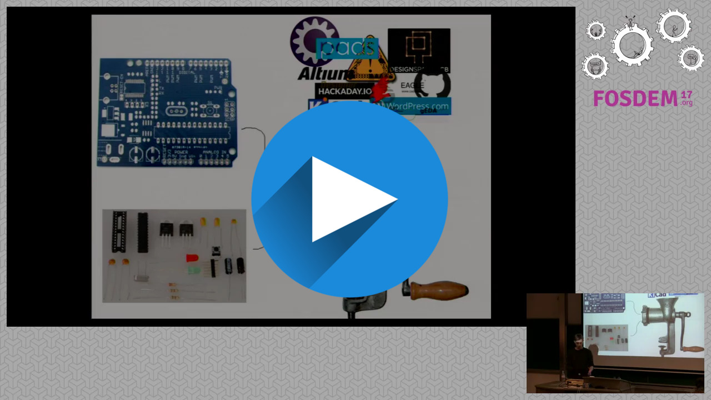

# https://kitnic.it
**We are giving away free PCB manufacturing vouchers to the first 20
projects that register. Just follow the steps in the [submission preview](https://kitnic.it/submit). Current status: 3/20 left.**

[![build status][travis-status]](https://travis-ci.org/monostable/kitnic) 

[](https://video.fosdem.org/2017/AW1.120/kitnic_it.vp8.webm)

Kitnic is a registry of open source hardware electronics projects that are
ready to order and build. The most important elements of a Kitnic project page
are: 

- A prominent link to download the Gerber files and a preview rendering of the board
- The ability to quickly add the required components to a retailer shopping
  cart (using clever magic in the form of our [browser extension][1clickbom])


Help us build a open hardware repository of useful electronics projects!

## Get in touch

 - [Join Riot.im chat][riot.im] or IRC freenode#kitnic
 - [Post on our Google Groups mailing list](https://groups.google.com/forum/#!forum/kitnic-discuss)

## Submitting your project

Check out [kitnic.it/submit](https://kitnic.it/submit) which will guide you through the process.

### Kitnic.yaml format

Currently the `kitnic.yaml` makes use of the following fields:

```yaml
summary: A description for your project
site: A site you would like to link to (include http:// or https://)
color: The solder resist color of the preview rendering. Can be one of: 
       - green
       - red
       - blue
       - black
       - white
       - orange
       - purple 
       - yellow
bom: A path to your 1-click-bom in case it isn't `1-click-bom.tsv`.
gerbers: A path to your folder of gerbers in case it isn't `gerbers/`.

```
Paths should be in UNIX style (i.e. use `/` not `\`) and relative to the root
of your repository. The YAML format is pretty straight forward but if you need
to know more check the example below and [the YAML website][6]. Use [this YAML
validator][yamllint] to be extra sure that your `kitnic.yaml` is valid.

### Some examples
Check out the repo links of the projects listed on
[kitnic.it](https://kitnic.it) already. The minimum required file tree is
something like :

```
.
├── 1-click-bom.tsv
└── gerbers
    ├── example.cmp
    ├── example.drd
    ├── example.dri
    ├── example.gko
    ├── example.gpi
    ├── example.gto
    ├── example.plc
    ├── example.sol
    ├── example.stc
    └── example.sts
```

A more advanced example could be something like:

```
.
├── kitnic.yaml
└── manufacture
    ├── advanced-example-BOM.tsv
    └── gerbers-and-drills
        ├── advanced-example-B_Adhes.gba
        ├── advanced-example-B_CrtYd.gbr
        ├── advanced-example-B_Cu.gbl
        ├── advanced-example-B_Fab.gbr
        ├── advanced-example-B_Mask.gbs
        ├── advanced-example-B_Paste.gbp
        ├── advanced-example-B_SilkS.gbo
        ├── advanced-example.drl
        ├── advanced-example-Edge_Cuts.gbr
        ├── advanced-example-F_Adhes.gta
        ├── advanced-example-F_CrtYd.gbr
        ├── advanced-example-F_Cu.gtl
        ├── advanced-example-F_Fab.gbr
        ├── advanced-example-F_Mask.gts
        ├── advanced-example-F_Paste.gtp
        └── advanced-example-F_SilkS.gto
```

with `kitnic.yaml` containing:

```yaml
summary: A more advanced example
site: https://example.com
color: red
bom: manufacture/advanced-example-BOM.tsv
gerbers: manufacture/gerbers-and-drills
```


## Development
### Requirements

- [Nodejs](https://nodejs.org) >= 6
- [fswatch](http://emcrisostomo.github.io/fswatch/) on OSX/Windows or inotify-tools on Linux
- [Ninja Build](https://github.com/ninja-build/ninja/releases) >= 1.5.1
- The rest of the dependencies can be retrieved via `npm install`

### Running a local dev server

- Get requirements above and make sure executables are on your path
- `npm install` (or `yarn install`)
- `npm start` (or `yarn start`)
- Point your browser at `http://127.0.0.1:8080`. The script should watch for
file-saves and re-build when you change a source file.


[viewer]: http://viewer.tracespace.io
[1clickbom]: https://1clickBOM.com
[yamllint]: http://www.yamllint.com
[1clickbom#making]: https://1clickbom.com/#making-a-1-click-bom
[travis-status]: https://travis-ci.org/monostable/kitnic.svg?branch=master
[riot.im]: https://riot.im/app/#/room/#kitnic:matrix.org

[4]: https://help.github.com/articles/create-a-repo/
[5]: https://help.github.com/articles/adding-a-file-to-a-repository/
[6]: http://www.yaml.org/start.html
[8]: https://img.shields.io/badge/mailing--list-kitnic--discuss-green.svg
