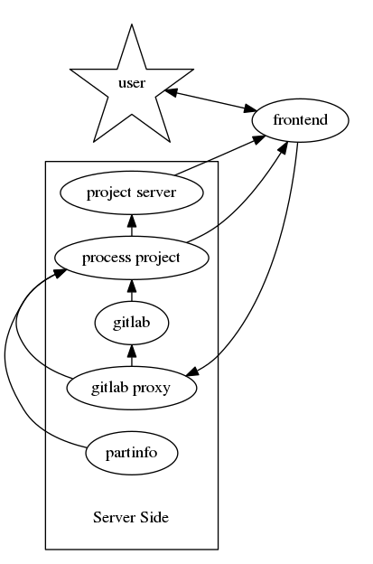

# https://kitspace.org

[![build status][travis-status]](https://travis-ci.org/kitspace/kitspace)
[](#backers)
[](#sponsors)

> [Watch a 5 minute lightning talk about Kitspace from the 35c3 congress](https://media.ccc.de/v/35c3-9566-lightning_talks_day_2#t=477).

[](https://media.ccc.de/v/35c3-9566-lightning_talks_day_2#t=477)

Kitspace (formerly Kitnic) is a registry of open source hardware electronics
projects that are ready to order and build. It could be described as a
"Thingiverse for electronics". The most important elements of a Kit Space
project page are:

- A prominent link to download the Gerber files and a preview rendering of the board
- The ability to quickly add the required components to a retailer shopping
  cart (using our [browser extension][1clickbom])


Help us build an open hardware repository of useful electronics projects!

## pcb-stackup

The renderings of the PCB files are made using [pcb-stackup](https://github.com/tracespace/pcb-stackup).
You can get similar renderings and also inspect invdividual layers, using the [tracespace gerber viewer](http://viewer.tracespace.io).

## Get in touch

 - [Join Riot.im chat][riot.im] or IRC freenode#kitspace
 - [Post on our Google Groups mailing list](https://groups.google.com/forum/#!forum/kitspace)

## Submitting your project

Check out [kitspace.org/submit](https://kitspace.org/submit) which will guide you through the process.

### kitspace.yaml format

Currently the `kitspace.yaml` makes use of the following fields:

```yaml
summary: A description for your project
site: A site you would like to link to (include http:// or https://)
color: The solder resist color of the preview rendering. Can be one of:
       - green
       - red
       - blue
       - black
       - white
       - orange
       - purple
       - yellow
bom: A path to your 1-click-bom in case it isn't `1-click-bom.tsv`.
gerbers: A path to your folder of gerbers in case it isn't `gerbers/`.
multi: Identifier field only used if the repository contains multiple projects.

```
Paths should be in UNIX style (i.e. use `/` not `\`) and relative to the root
of your repository. The YAML format is pretty straight forward but if you need
to know more check the example below and [the YAML website][6]. Use [this YAML
validator][yamllint] to be extra sure that your `kitspace.yaml` is valid.

### Some examples
Check out the repo links of the projects listed on
[kitspace.org](https://kitspace.org) already. The minimum required file tree is
something like :

```
.
├── 1-click-bom.tsv
└── gerbers
    ├── example.cmp
    ├── example.drd
    ├── example.dri
    ├── example.gko
    ├── example.gpi
    ├── example.gto
    ├── example.plc
    ├── example.sol
    ├── example.stc
    └── example.sts
```

A more advanced example could be something like:

```
.
├── kitspace.yaml
└── manufacture
    ├── advanced-example-BOM.tsv
    └── gerbers-and-drills
        ├── advanced-example-B_Adhes.gba
        ├── advanced-example-B_CrtYd.gbr
        ├── advanced-example-B_Cu.gbl
        ├── advanced-example-B_Fab.gbr
        ├── advanced-example-B_Mask.gbs
        ├── advanced-example-B_Paste.gbp
        ├── advanced-example-B_SilkS.gbo
        ├── advanced-example.drl
        ├── advanced-example-Edge_Cuts.gbr
        ├── advanced-example-F_Adhes.gta
        ├── advanced-example-F_CrtYd.gbr
        ├── advanced-example-F_Cu.gtl
        ├── advanced-example-F_Fab.gbr
        ├── advanced-example-F_Mask.gts
        ├── advanced-example-F_Paste.gtp
        └── advanced-example-F_SilkS.gto
```

with `kitspace.yaml` containing:

```yaml
summary: A more advanced example
site: https://example.com
color: red
bom: manufacture/advanced-example-BOM.tsv
gerbers: manufacture/gerbers-and-drills
```

#### The multi field

> NOTE: `multi` doesn't yet work with the [kitspace.org/submit](https://kitspace.org/submit) preview tool. See issue [#182](https://github.com/kitspace/kitspace/issues/182).

Kitspace supports multiple projects in one repository with the `multi` field. When multiple projects exist, `multi` will always be the first field in the `kitspace.yaml`, with the paths to your projects folder nested underneath.

```
├── kitspace.yaml
├── project_one
│   ├── 1-click-bom.tsv
│   ├── README.md
│   └── gerbers
│       ├── example.cmp
│       ├── example.drd
│       ├── example.dri
│        ...
│       ├── example.stc
│       └── example.sts
└── project_two
    ├── 1-click-bom.tsv
    ├── README.md
    └── gerbers
        ├── example.cmp
        ├── example.drd
        ├── example.dri
         ...
        ├── example.stc
        └── example.sts

```

with `kitspace.yaml` containing:

```yaml
multi:
    project_one:
        summary: First project in a repository.
        color: blue
        site: https://example-one.com
    project_two:
        summary: Second project in a repository.
        color: red
        site: https://example-two.com
```

If you want to use custom paths for `bom` and `gerbers` then note that these are from the root of the repository. There is currently no way to change the path of the README (see issue [#183](https://github.com/kitspace/kitspace/issues/183)).

E.g.

```
├── kitspace.yaml
├── manufacturing_outputs
│   └── project_one_gerbers
│       ├── example.cmp
│       ├── example.drd
│       ├── example.dri
│        ...
│       ├── example.stc
│       └── example.sts
├── project_one
    ├── BOM.csv
    └── README.md
└── project_two
    ├── README.md
    ...
```

```yaml
multi:
    project_one:
        bom: project_one/BOM.csv
        gerbers: manufacturing_outputs/project_one_gerbers
    project_two:
      ...
```

## Development

### Architecture

#### Current
This repository is the Kitspace front-end. The contents including all project
data are currently pre-compiled into a static site.  The main part of the site
that requires server side components is the submission preview (`/submit`). Pages also use freegeoip lookup to decide what sites to link to for people that do not have the 1-click BOM browser extension. This roughly illustrates the main data flow when someone is browsing the site.


We have two services running for the submission preview.

- [git-clone-server](https://github.com/kasbah/git-clone-server) for serving up files from git repositories.
- [partinfo](https://github.com/kitspace/kitspace-partinfo) for getting part information for the BOM.

And one for the geo ip lookup on pages.

- [freegeoip](https://github.com/fiorix/freegeoip)

#### Planned

We are using [GitLab](https://gitlab.com/gitlab-org/gitlab-ce) as an authentication and Git hosting service. We modify and proxy it to get the functionality we need.
The graphs get too complicated if we try to add all the possible data-flows but here is the rough data-flow for submission of a project.



Services used are:

- [nginx-config](https://github.com/monostable/kitnic-nginx-config) to configure Nginx to serve the frontend and all services.
- [partinfo](https://github.com/kitspace/kitspace-partinfo) for getting part information for BOMs.
- [gitlab-config](http://github.com/monostable/kitnic-gitlab-config) configuring GitLab to be used for authentication and Git hosting.
- [gitlab-proxy](https://github.com/monostable/kitnic-gitlab-proxy) for requests that need to access GitLab API but need any kind of added functionality like unauthenticated access or modifying projects (which needs additional hooks to trigger processing).

### Roadmap

- [ ] GitLab and Accounts
   - [x] Modify GitLab and integrate with login in Kitspace frontend
   - [x] Build frontend for basic account settings
   - [ ] Make GitLab source of user projects
- [ ] Upload submissions and editing
   - [ ] Allow for file upload to GitLab
   - [ ] Gerber plotter processing for KiCAD and Eagle
   - [ ] BOM extraction processing
   - [ ] BOM Builder
       - [ ] Get retailer info out of [partinfo](https://github.com/kitspace/kitspace-partinfo)

### Requirements

- [Nodejs](https://nodejs.org) version 6 (v6.17.1)
- [fswatch](http://emcrisostomo.github.io/fswatch/) on OSX/Windows or inotify-tools on Linux
- [Ninja Build](https://github.com/ninja-build/ninja/releases) >= 1.5.1
- [Yarn](https://yarnpkg.com/) to ensure the correct dependencies are installed
- The rest of the dependencies can be retrieved via `yarn install`

### Running a local dev server

- Get requirements above and make sure executables are on your path
- `yarn install`
- `yarn start` (or `npm start`)
- Point your browser at `http://127.0.0.1:8080`. The script should watch for
file-saves and re-build when you change a source file.


[viewer]: http://viewer.tracespace.io
[1clickbom]: https://1clickBOM.com
[yamllint]: http://www.yamllint.com
[1clickbom#making]: https://1clickbom.com/#making-a-1-click-bom
[travis-status]: https://travis-ci.org/kitspace/kitspace.svg?branch=master
[riot.im]: https://riot.im/app/#/room/#kitspace:matrix.org

[4]: https://help.github.com/articles/create-a-repo/
[5]: https://help.github.com/articles/adding-a-file-to-a-repository/
[6]: http://www.yaml.org/start.html

## Contributors

This project exists thanks to all the people who contribute.
<a href="https://github.com/kitspace/kitspace/graphs/contributors"></a>


## Backers

Thank you to all our backers! 🙏 [[Become a backer](https://opencollective.com/kitspace#backer)]

<a href="https://opencollective.com/kitspace#backers" target="_blank"></a>


## Sponsors

Support this project by becoming a sponsor. Your logo will show up here with a link to your website. [[Become a sponsor](https://opencollective.com/kitspace#sponsor)]

<a href="https://opencollective.com/kitspace/sponsor/0/website" target="_blank"></a>
<a href="https://opencollective.com/kitspace/sponsor/1/website" target="_blank"></a>
<a href="https://opencollective.com/kitspace/sponsor/2/website" target="_blank"></a>
<a href="https://opencollective.com/kitspace/sponsor/3/website" target="_blank"></a>
<a href="https://opencollective.com/kitspace/sponsor/4/website" target="_blank"></a>
<a href="https://opencollective.com/kitspace/sponsor/5/website" target="_blank"></a>
<a href="https://opencollective.com/kitspace/sponsor/6/website" target="_blank"></a>
<a href="https://opencollective.com/kitspace/sponsor/7/website" target="_blank"></a>
<a href="https://opencollective.com/kitspace/sponsor/8/website" target="_blank"></a>
<a href="https://opencollective.com/kitspace/sponsor/9/website" target="_blank"></a>


