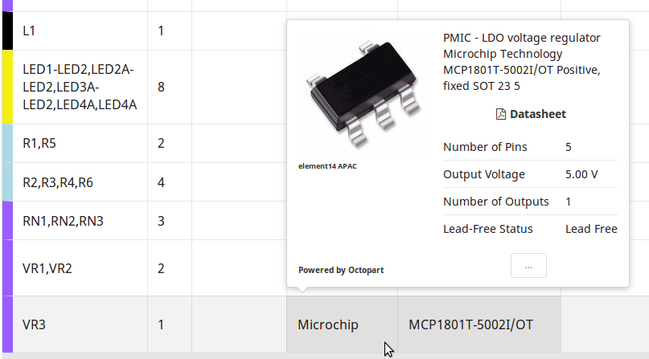

# Kitnic Partinfo 

A microservice to get information on electronic components. This is used on [kitnic.it](https://kitnic.it) to get the part information for the BOM popups.

This is a [GraphQL](http://graphql.org/) API, the schema is detailed in [schema.js](src/schema.js). Currently it is simply a subset and re-arrangement of the information retrieved from the [Octopart API](https://octopart.com/api/home) but additional API backends or web scraping could be added in the future. 
